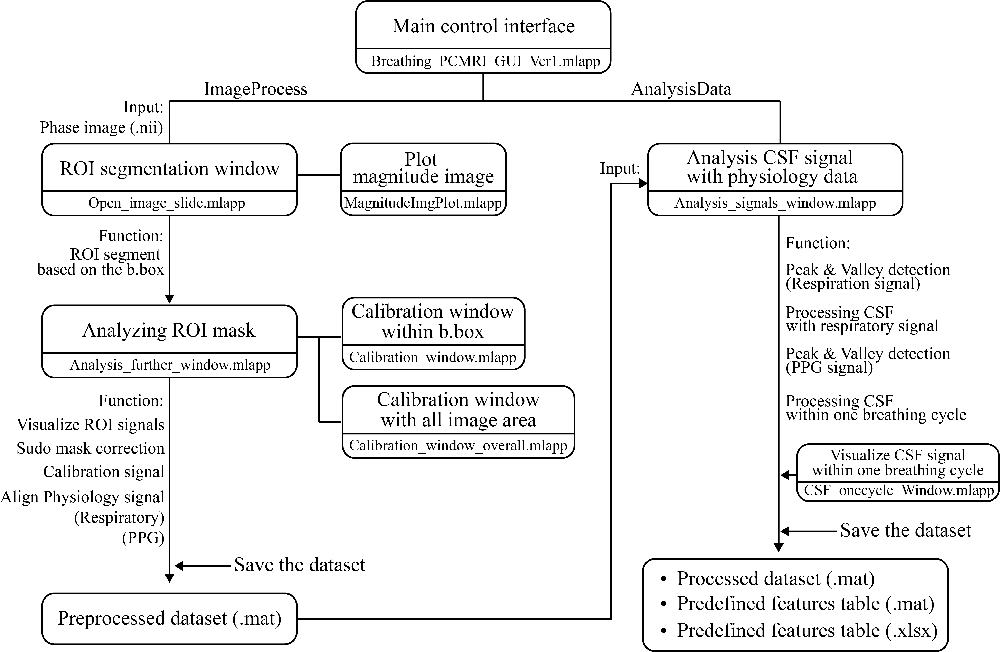

# NeuroNetFlow
A MATLAB-based software toolbox for integrated analysis of cerebrospinal fluid flow dynamics using phase-contrast MRI

## 1. Project Overview

NeuroNetFlow is an open-source, GUI-based MATLAB software toolbox designed for the integrated analysis of cerebrospinal fluid (CSF) dynamics using phase-contrast MRI (PC-MRI) in combination with cardiorespiratory physiological signals.

Cerebrospinal fluid plays a critical role in maintaining central nervous system homeostasis, including mechanical buffering, buoyancy, and metabolic waste clearance. While CSF flow has traditionally been attributed primarily to cardiac-driven pulsatility, accumulating evidence highlights respiration as a major contributor to CSF circulation through venous return mechanisms. Importantly, breathing patterns in humans are highly variable and can be voluntarily modulated, offering a potential non-invasive pathway to influence CSF dynamics.

Recent advances in velocity-encoded MRI enable the direct quantification of both cardiac and respiratory components of CSF motion. However, comprehensive analysis remains challenging due to the limited availability of open-source tools that integrate PC-MRI data with physiological recordings in an accessible graphical environment. NeuroNetFlow addresses this gap by providing a modular, user-friendly GUI that substantially reduces manual coding effort while ensuring reproducibility and transparency.


## 2. Installation

### Step 1: Download
```bash
git clone https://github.com/SeokbeenLim/NeuroNetFlow.git
```
### Step 2: Add MATLAB Path
```bash
addpath(genpath(pwd));
savepath;
```
### Step 3: Launch
```bash
Breathing_PCMRI_GUI_Ver1
```


## 3. Pipeline Overview
NeuroNetFlow follows a predefined yet flexible analysis pipeline:

**Input**
- Phase-contrast MRI (magnitude and phase images)
- Physiological recordings (respiration belt, PPG, system markers)

**Processing**
- Semi-automatic CSF ROI segmentation
- Static tissue-based velocity calibration
- Cardiac- and respiratory-specific CSF signal isolation
- Temporal synchronization with physiological signals

**Output**
- CSF velocity waveforms
- CSF flow rate (ml/s)
- CSF volume displacement (ml)
- CSF net flow

## 4. Key Features

- GUI-based integrated analysis of PC-MRI and physiological data
- Semi-automatic CSF ROI segmentation with interactive mask editing
- Static tissue-based phase calibration for velocity correction
- Extraction of cardiac- and respiratory-driven CSF components
- Time- and frequency-domain analysis of CSF and physiology signals
- Modular App Designer architecture supporting extensibility


## 5. Software Architecture

NeuroNetFlow is built on a modular MATLAB App Designer architecture centered around a main control interface.



### Main Control Interface
- **Breathing_PCMRI_GUI_Ver1.mlapp**  
  Central hub for data loading, parameter configuration, and execution of CSF analysis workflows.

### Associated Sub-GUI Windows
- Analysis_further_window.mlapp – Advanced parameter tuning  
- Analysis_signals_window.mlapp – Time- and frequency-domain signal analysis  
- CSF_onecycle_Window.mlapp – Single respiratory cycle analysis  
- Calibration_window.mlapp – Static tissue-based calibration  
- Calibration_window_overall.mlapp – Global calibration validation  
- MagnitudeImgPlot.mlapp – Magnitude image and ROI inspection  
- Open_image_slide.mlapp – Multi-slice image viewer  

All dependencies were validated using MATLAB Dependency Analyzer.
